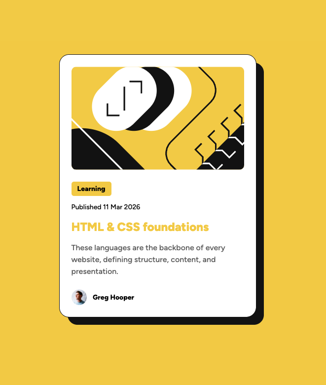

# Frontend Mentor - Blog preview card solution

This is a solution to the [Blog preview card challenge on Frontend Mentor](https://www.frontendmentor.io/challenges/blog-preview-card-ckPaj01IcS). Frontend Mentor challenges help you improve your coding skills by building realistic projects. 

## Table of contents

- [Overview](#overview)
  - [The challenge](#the-challenge)
  - [Screenshot](#screenshot)
  - [Links](#links)
- [My process](#my-process)
  - [Built with](#built-with)
  - [What I learned](#what-i-learned)
  - [Continued development](#continued-development)
  - [Useful resources](#useful-resources)
  - [AI Collaboration](#ai-collaboration)
- [Author](#author)

## Overview

### The challenge

Users should be able to:

- See hover and focus states for all interactive elements on the page

### Screenshot



### Links

- Solution URL: [GitHub](https://github.com/MichalGajda/fm-blog-preview-card)
- Live Site URL: [Add live site URL here](https://your-live-site-url.com)

## My process

### Built with

- Semantic HTML5 markup
- CSS custom properties
- Flexbox
- CSS Grid
<!-- - Mobile-first workflow -->
- [React](https://reactjs.org/) - JS library

### What I learned

- Difference between :focus and :focus-visible pseudoclasses
- Modern CSS reset/starter
- How to make bottom footer with grid
- A nice usecase for inset property
- How to use @font-face

To see how you can add code snippets, see below:

```css
.blog-card-container::after {
  position: absolute;
  inset: 0;
}
```
instead of:
```css
.blog-card-container::after {
  position: absolute;
  width: 100%;
  height: 100%;
  bottom: 0;
  right: 0;
}
```

### Continued development

- Continue using grid for easy wins.

### Useful resources

- [CSS reset](https://www.joshwcomeau.com/css/custom-css-reset/) - CSS reset for less headaches.

### AI Collaboration

- What tools did you use (e.g., ChatGPT, Claude, GitHub Copilot)?
- How did you use them (e.g., debugging, generating boilerplate, brainstorming solutions)?
- What worked well? What didn't?

## Author

- Frontend Mentor - [@MichalGajda](https://www.frontendmentor.io/profile/MichalGajda)
